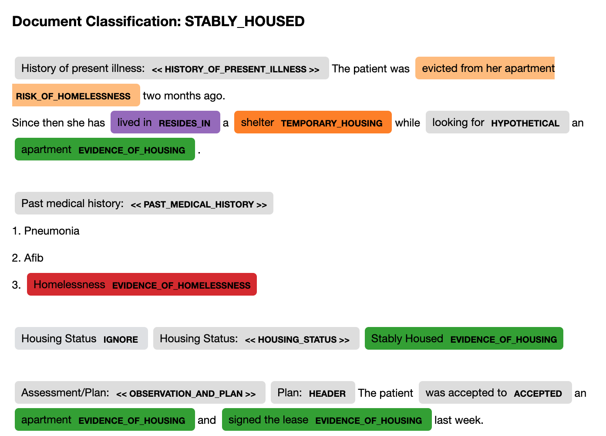
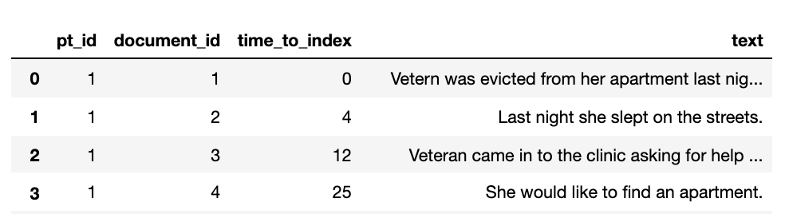
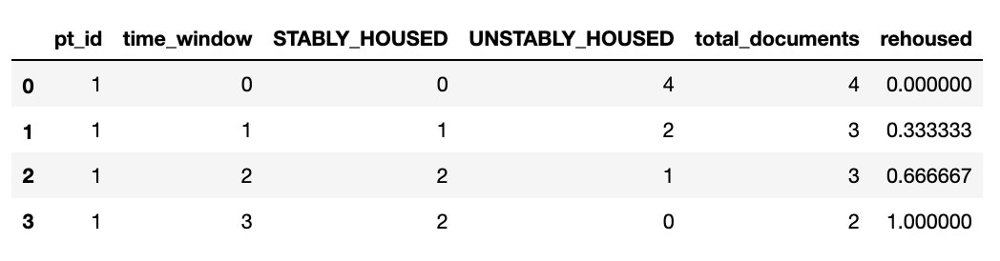

# ReHouSED NLP
## Overview
This package is a [medspaCy](https://github.com/medspacy/medspacy) implementation of an NLP system for identifying patient housing stability in clinical texts.
This system was originally developed in the Department of Veterans Affairs to study housing outcomes of Veterans participating
in the Supportive Service for Veteran Families (SSVF) program. The development and validation of this system is described in
["ReHouSED: A Novel Measurement of Veteran Housing Stability Using Natural Language Processing"](https://www.sciencedirect.com/science/article/pii/S153204642100232X) by Chapman et al. (published Journal of Biomedical Informatics).

This system attempts to classify housing stability at two levels:
1. **Document-level**: Each document processed by the NLP is classified as either **"STABLY_HOUSED"**, **"UNSTABLY_HOUSED"**, or **"UNKNOWN"**
2. **Patient-level**: A set of documents over a period of time are processed and aggregated to a patient level. This is a numeric score
ranging from 0-1 called **"Relative Housing Stability in Electronic Documentation" (ReHouSED)**

Detailed examples and explanations of the logic are provided in `notebooks/`.

ReHouSED has used been in a few additional papers as well:

- [Using natural language processing to study homelessness longitudinally with electronic health record data subject to irregular observations](https://www.medrxiv.org/content/10.1101/2023.03.17.23287414v1) To be presented at AMIA Annual Symposium 2023 (preprint)
- [Assessing longitudinal housing status using Electronic Health Record data: a comparison of natural language processing, structured data, and patient-reported history](https://www.frontiersin.org/articles/10.3389/frai.2023.1187501/full)

## Disclaimer
This system is an approximation of the system described in the manuscript and has been modified to exclude logic specific to VA 
documentation. It is far from perfect and will certainly make mistakes!

## Installation
You can install `rehoused_nlp` using `pip`:
```bash
pip install rehoused-nlp
```

Or the source code found in this repository:
```python
python setup.py install
```

`rehoused_nlp` requires Python 3.7 or 3.8, medspaCy==0.2.0.1, and spaCy spacy>=3.1.3,<3.2.0. 

## Quick start

### Document-level example
```python
from rehoused_nlp import build_nlp, visualize_doc_classification

nlp = build_nlp()

text = """
History of present illness: The patient was evicted from her apartment two months ago. 
Since then she has lived in a shelter while looking for an apartment.

Past medical history:
1. Pneumonia
2. Afib
3. Homelessness

Housing Status: Stably Housed

Assessment/Plan: The patient was accepted to an apartment and signed the lease last week. 
"""

doc = nlp(text)

visualize_doc_classification(doc)
```



### Patient-level example
```python
from rehoused_nlp import calculate_rehoused
import pandas as pd

df = pd.read_csv("path/to/data.tsv", sep="\t")
print("Input:")
df.head()

print("Output:")
rehoused = calculate_rehoused(df)
rehoused.head()

```
#### Input:


#### Output:

